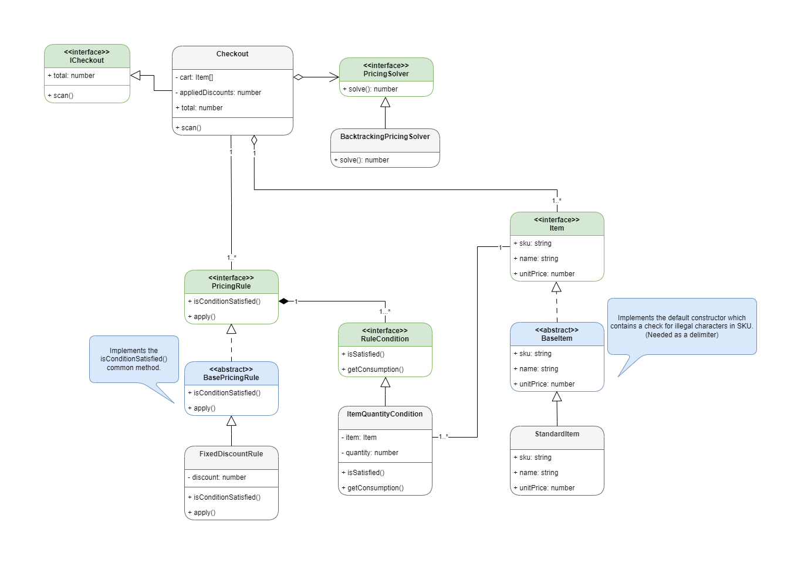

# Kata Nine
This repository is my attempt at [CodeKata 09](http://codekata.com/kata/kata09-back-to-the-checkout/).

The CodeKata presents a scenario where we have to calculate the total price of an arbitrary collection of items.

```
  Item   Unit      Special
         Price     Price
  --------------------------
    A     50       3 for 130
    B     30       2 for 45
    C     20
    D     15
```

As seen above, there are also *special prices* for some items. In the CodeKata, this is limited to single-item discounts - i.e. `x` of some item results in a `y` discount.

I wanted to tackle the more general case of discounts where the condition is an arbitrary collection of items. (E.g. 2 of A, 3 of B, and 1 of C results in a $30 discount). Furthermore, I aimed to design the classes in a way that allows for extension for other conditions and pricing rules with minimal friction.

Please see [technical implementation notes](#technical-implementation-notes) for more on the design!

## Running
> [!NOTE]  
> An installation of [Node.js](https://nodejs.org/en) (`version >= 20`) is required.

First, clone the repo and install the dependencies.
```
git clone https://github.com/wjin-lee/kata-nine.git
cd ./kata-nine

npm install
```
To run `index.ts`, execute the following:
```
npm run start
```

## Testing
Testing is implemented with [Jest](https://jestjs.io/). \
To run the test suite, execute the following command:
```
npm run test
```

To run tests while watching for changes, (*"hot-reloading"*), run the following command:
```
npm run test:watch
```

## Technical Implementation Notes
Below is the class diagram *(more like rev. 7 of the class diagram)* I referenced during initial development and the subsequent implementation. The main focus was put on decoupling the checkout from item and pricing rules / calculations as much as possible.



### How are pricing rules captured?
Notably, the pricing rules and the logic embedded within them are separated away from the checkout class. The pricing rules were further split into two concepts:

First encapsulates the ***"condition"*** - the criteria that must be fulfilled for some action to occur. This manifests as concrete classes implementing the `RuleCondition` interface. It may be strange to see `getConsumption()` at first - the method returns the items "used" or *"consumed"* by the condition. This is a consequence of our assertion that discount optimisation is always done **without replacement**. The concept of condition for action and the consumed items are irrevocably coupled, and thus, it is natural to include a method here. See my [Note on Item Replacement](#note-on-item-replacement) on why I assert the *"without replacement"* clause.


Second encapsulates the ***"action"*** - the effect that can be applied when the condition is fulfilled. This manifests as concrete pricing rule classes. Currently, there is only one effect - a flat discount by a constant amount. Theoretically, this could be extended to cover various actions such as discounting by a percentage or even adding a bonus SKU for a *"buy a BRAND_NAME TV for a free soundbar"* type of deal as it can affect the whole cart state, not just the discount price. Originally, I had captured this as a separate inheritance chain entirely via a `PricingRuleModifier` interface, which would be in a composition relationship with `PricingRule`; however, that made `PricingRule` a bit redundant, so the two were merged.

### Note on Item Replacement
During implementation, I came across an interesting case where a user may want to define a discount condition with replacement. That is to say, given discount $\alpha$ (condition: 3x $A$, 1x $B$, discount: $20$) and discount $\beta$ (condition: 1x $A$, 2x $B$, discount: $10$), a user may want both discounts to be applied when there are only 3 item $A$ s and 2 item $B$ s in the cart.

During discount optimisation, this introduces a dissonant requirement where discount $\alpha$ must *"consume"* the cart items if the next (and any future) discounts are itself (or others also marked as "no replacement") and not consume anything if the next (and any future) discounts are marked as "with replacement".

In the latest implementation, the intended solution to this problem is to create a third discount $\gamma$ (condition: 3x $A$, 2x $B$, discount: $30$). This removes implementational complexity and clears ambiguities for the user as a user **must** explicitly intend to discount using both conditions with replacement.

### Pricing Solvers
Once an arbitrary set of items and pricing rules are defined, the next step is to solve for the optimal combination that results in the largest possible discount. (Assuming our point-of-sale has the customer's feelings in mind). I thought of various algorithms for the solver, and I made sure to architect the class design to minimise friction for future extensions/solvers. 

Originally, I wanted to implement a dynamic programming solution, aiming to exploit the `Checkout` interface's property of only accepting one item at a time. I thought I could keep the memoised table and cut down on some of the computation. However, as I thought more about the exponential time complexity, I realised it would *probably* result in more complexity for minimal practical benefit. In the smaller cases, DFS on the state space + pruning is likely easier to understand and implement without bugs. In the larger cases, we should look to other optimisations as keeping an exponentially growing memoisation table in memory would likely be infeasible.

## Next Steps and Optimisations
- The backtracking solver has a time complexity of $O(R\times N_1\times N_2\times ...N_n)$ where $R$ is the number of pricing rules and $N_{1..n}$ are the cart item counts. This is not ideal, and it would be interesting to implement a solver using an Integer Linear Programming (ILP) formulation. Although ILP also takes exponential time in theory, solver implementations are much more optimised than my current implementation, hence my optimism for a nice speed boost.
  
- Plenty of low-effort optimisations are also available - we could filter the pricing rules to remove those that cannot be applied from the beginning for example. As most products won't have very many simultaneously ongoing discounts, this alone may be sufficient for most retail stores.
  
- We could also aim to implement it via web assembly or offload the work to a more powerful server, which will also add the benefit of consistency.
